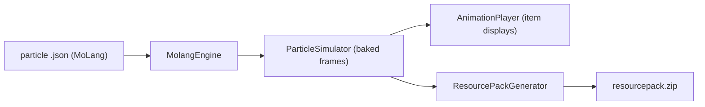

# MoParticles

MoParticles is a Paper plugin that brings **Bedrock-style particle effects to Java Edition**. It parses **MoLang** particle definitions — the same JSON format used by Bedrock and the [SnowStorm](https://github.com/JannisX11/snowstorm) effect ecosystem — and converts them into smooth, Java-compatible animations rendered with vanilla **item displays**.

No client mod. No custom protocol. No configuration to get started.

## How it works

MoParticles turns a static MoLang definition into a playable animation in four steps:

1. **Parse** — your effect's `.json` file (the Bedrock `particle_effect` format) is read and its MoLang expressions — math functions, query functions, variables — are evaluated by a built-in MoLang engine.
2. **Bake** — the effect is simulated ahead of time and compressed into a sequence of pre-computed frames. At runtime the plugin only plays back baked data; it never evaluates MoLang per-tick.
3. **Render** — each frame is played with vanilla `ItemDisplay` entities and item models, so everything stays within the vanilla protocol.
4. **Pack** — a resource pack containing the item models and the synthesized particle textures is generated for you at `plugins/MoParticles/generated/resourcepack.zip`.



## Why MoParticles?

- **Reuse existing Bedrock effects.** Drop in any compatible MoLang particle JSON — the bundled examples are taken straight from SnowStorm.
- **Pure vanilla rendering.** Item displays + item models. Anything a resource pack can describe, MoParticles can play.
- **Cheap at runtime.** All of the expensive simulation happens once, when the effect is loaded — not on every tick.
- **A real API.** Your plugin can list, play, and stop effects with a few lines of code.

## Included effects

Three effects ship with the plugin, extracted from [SnowStorm](https://github.com/JannisX11/snowstorm):

| Effect ID | Description |
| --- | --- |
| `snowstorm:fire` | A custom fire particle with tinted, fading embers |
| `snowstorm:loading` | SnowStorm's loading-circle spinner |
| `snowstorm:rainbow` | A looping rainbow particle animation |

Try one out right away:

```text
/moparticles playhere snowstorm:fire
```

## Links

- [GitHub repository](https://github.com/Chest-Solutions/MoParticles)
- [Releases & downloads](https://github.com/Chest-Solutions/MoParticles/releases)
- [Next: Getting started →](/docs/moparticles/getting-started)
